# GSMG Telegram Export — Stage 2 Media Shortlist

Bounded shortlist of 50 media messages (of ~4,900 in the complete 2026-07-26
export) surfaced by `tools/gsmg/telegram_export_anchor_media_triage.py`:
anchor-window/reply/same-sender hits around the messages already established
as central to the recovered prime-walk provenance (Phase 48/53/54), plus a
filename/caption keyword pre-filter. Frozen here before Stage 3 (OCR) so the
shortlist itself is reviewable and reproducible independent of OCR output.

Reproduce with: `python3 tools/gsmg/telegram_export_anchor_media_triage.py --json-out <path>`

The **file** column shows a small local thumbnail and an **open** link to a
full-size local copy -- both regenerated (gitignored, ~3MB total) into
`doc/telegram_shortlist_thumbnails/` and `doc/telegram_shortlist_fullsize/`
since VS Code's Markdown preview sandboxes both image loading and link
navigation to the workspace and cannot reach the original export folder
(`/home/loginwashere/Downloads/Telegram Desktop/ChatExport_2026-07-26`) directly.
Regenerate any time with
`python3 tools/gsmg/telegram_shortlist_thumbnails.py`.

| id | date | sender | type | file | match reason(s) | caption |
|---:|---|---|---|---|---|---|
| 4525 | 2020-06-30T11:32:31 | Legik | image | 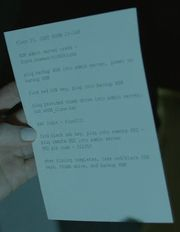 [open](telegram_shortlist_fullsize/4525.jpg) | keyword:instruction | Angela holds instructions |
| 11987 | 2023-08-23T22:40:09 | zvgolden | image | 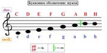 [open](telegram_shortlist_fullsize/11987.jpg) | keyword:faed | Faed ? |
| 12146 | 2023-08-24T05:34:03 | ArchOptic | text | [open](telegram_shortlist_fullsize/12146.py) | keyword:dbbi, keyword:faed | modify value at line 75 to select your own base conversion. Please verify output before trusting it. cursory it looks fine. outputs base converted dbbibd and faed, intertwined dbbib and faed, reverse  |
| 15490 | 2023-09-27T16:52:42 | RB | image | 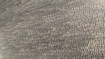 [open](telegram_shortlist_fullsize/15490.jpg) | keyword:dbbi | Some nice artwork from a museum i just visit. Seeing dbbi everywhere 😅 |
| 15878 | 2023-10-08T23:43:27 |  | image | 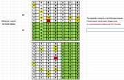 [open](telegram_shortlist_fullsize/15878.png) | keyword:dbbi | Im not done yet..... Here I got that center A in the red square... still dbbib in 7x13 or 13xx7 and as you can see the other letters shift around as they should....  "H" however in the yellow highligh |
| 15879 | 2023-10-08T23:46:08 |  | image | 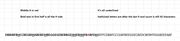 [open](telegram_shortlist_fullsize/15879.png) | keyword:dbbi | here is DBBIB in a straight line so you can see that the grid plays no part in the seperation....   That makes the second half of the string being without any H's, only an 8 character string now ( pos |
| 16870 | 2023-11-27T01:59:18 |  | image | 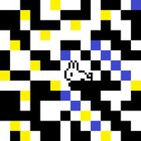 [open](telegram_shortlist_fullsize/16870.png) | keyword:yellow blue | yellow blue swapped |
| 16872 | 2023-11-27T02:06:44 |  | image | 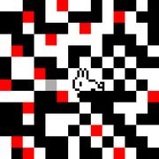 [open](telegram_shortlist_fullsize/16872.png) | keyword:yellow blue | yellow blue swapped and gamma at .01 in photoshop |
| 17790 | 2023-12-19T21:20:36 | Legik | text | [open](telegram_shortlist_fullsize/17790.txt) | keyword:dbbi | it turned out something like the Bacon cipher |
| 19507 | 2024-01-13T20:50:36 | Legik | text | [open](telegram_shortlist_fullsize/19507.txt) | keyword:dbbi | a0j10 |
| 21665 | 2024-03-01T21:55:11 |  | image |  [open](telegram_shortlist_fullsize/21665.jpg) | keyword:yellow blue | he don't said numbers   he said number is   if he just don't add the " s " in the word numbers he will use "are "   not is    then said   yellow blue primes ..  so after that said matrix sum list    i |
| 23800 | 2024-04-06T18:27:48 | Sycorax | image |  [open](telegram_shortlist_fullsize/23800.png) | keyword:dbbi | Here is a screenshot of the result |
| 24115 | 2024-04-11T05:03:08 |  | image | 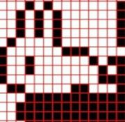 [open](telegram_shortlist_fullsize/24115.jpg) | keyword:dbbi | Can someone overlay dbbib on this image with it's spaces included? I'm on my phone at the moment, thank you for any help here |
| 24236 | 2024-04-14T04:17:03 | Chelton Berliew | image |  [open](telegram_shortlist_fullsize/24236.jpg) | keyword:dbbi | Any bodies gears spinning?? I was trying to solve Dbbi and while I don’t believe it’s Vigenère cipher i got some interesting results |
| 29147 | 2024-11-11T02:10:21 | ArchOptic | text | [open](telegram_shortlist_fullsize/29147.py) | keyword:dbbi, keyword:faed | It needs some more variation in decryption methods and more discretion for filtering outputs but it's a good skeleton for my current line of thinking about dbbib and faed being binary sets of various  |
| 30267 | 2024-11-15T13:28:31 | Tobi | image | 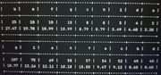 [open](telegram_shortlist_fullsize/30267.jpg) | keyword:dbbi | here is the frequency of dbbi and fead, can you tell me what you mean with strange frequency please |
| 31184 | 2024-11-25T15:53:07 |  | image | 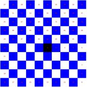 [open](telegram_shortlist_fullsize/31184.jpg) | keyword:yellow blue | Blue is more abundant than yellow, meaning it leans towards the "yang" which is the active force. Investigate spatial arrangements within these colors.   Black (0, 0, 0, 255): 54,675 pixels Blue (63,  |
| 36646 | 2025-03-03T07:12:13 | Janusz Baran | image |  [open](telegram_shortlist_fullsize/36646.jpg) | keyword:dbbi | As for dbbibbla bla thought that on this xor you need to make some value, here an example. \ |
| 37001 | 2025-03-14T13:14:00 | gnomad | image | 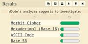 [open](telegram_shortlist_fullsize/37001.jpg) | keyword:faed | faed why you like dis |
| 39170 | 2025-04-28T15:41:34 | Janusz Baran | image | 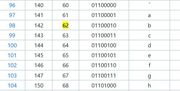 [open](telegram_shortlist_fullsize/39170.jpg) | keyword:zeroed | this is ostensibly a hint to a1z26 and to sumlist. I am still thinking of HUNDRED FOURTY and in the octal code we have such values, this sie refers to d b b i and f a e d. some value need to zeroed ou |
| 39937 | 2025-05-01T00:12:58 | Nik | image | 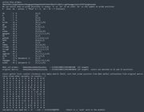 [open](telegram_shortlist_fullsize/39937.jpg) | is_the_anchor_itself | What are your thoughts on this approach? Discovered it quite a long time ago and didn't managed to develop further. |
| 41760 | 2025-05-30T20:55:22 | Sycorax | image |  [open](telegram_shortlist_fullsize/41760.png) | keyword:dbbi | Here is a screenshot of the result |
| 47076 | 2025-08-14T08:44:25 | Человек | image |  [open](telegram_shortlist_fullsize/47076.jpg) | keyword:dbbi | the reward is already so small that you can't even buy a roll of toilet paper. 😂  anyone solve first 'dbbi***' section? |
| 48058 | 2025-08-26T23:10:24 | Crypto_did_land_on_the_moon! | image |  [open](telegram_shortlist_fullsize/48058.jpg) | keyword:dbbi | Hey what do you guys think of this? Not sure if this has been tried before.  dbbibfbhccbegbihabebeihbeggegebebbgehhebhhfbabfdhbeffcdbbfcccgbfbeeggecbedcibfbffgigbeeeabe  If we subtitute each letters a |
| 48061 | 2025-08-26T23:12:27 | Crypto_did_land_on_the_moon! | image |  [open](telegram_shortlist_fullsize/48061.jpg) | keyword:faed | faed string is  inaheeaahisrhnrooeesnhsiahheiheretennaheetninaseoeeshntoaonornotesatierieaientinrtinenaeanserraneieeaaeenirnseishratiinnisthnoehaaieooseenaeharooaeaeosaenhirhtneaistseetihsenneeirtents |
| 49726 | 2025-10-03T03:28:45 | 3.14159265358979323846264338327950288419716939937510 0b1one\|58209749445923078164062862089986280348253421170679 | image | 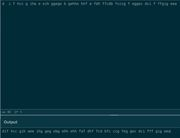 [open](telegram_shortlist_fullsize/49726.jpg) | keyword:zeroed | primes zeroed out |
| 50498 | 2025-10-15T12:12:43 | Che Gevara | image | 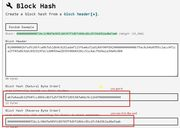 [open](telegram_shortlist_fullsize/50498.jpg) | keyword:instruction | This is just a direction, I don't mind sharing information. I'm too lazy to explain everything in detail and provide instructions on what I'm talking about. I've already mentioned it, and if you're in |
| 50716 | 2025-10-19T03:03:16 | k1ng 😎 | image | 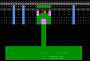 [open](telegram_shortlist_fullsize/50716.jpg) | keyword:dbbi | half of dbbi/incaseyou..   under we have gsmg.io/theseedisplanted together with the salph aes and 3.3  gsmg.io/theseed... = 192 bits both aes decoded base64 = 192 hex.  "remove the correct hint" was t |
| 51065 | 2025-10-25T15:47:42 | k1ng 😎 | image | 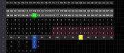 [open](telegram_shortlist_fullsize/51065.jpg) | keyword:dbbi | The lines with 171 seems to be what is removed when we apply dbbi. If you have not spent alot of time on the puzzle u wont understanf what i mean |
| 51069 | 2025-10-25T15:56:06 | k1ng 😎 | image | 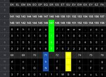 [open](telegram_shortlist_fullsize/51069.jpg) | keyword:dbbi | Here is another confirmation.  At index 147, it spells 147 downwards. This 147 appears between 71 and 73 in the dbbi pattern, which is exactly where the FEFEFE block is.  I wont share more on this.. |
| 51072 | 2025-10-25T16:21:10 | k1ng 😎 | image | 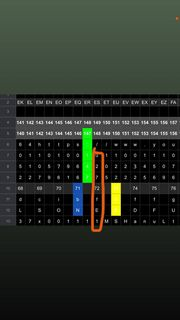 [open](telegram_shortlist_fullsize/51072.jpg) | keyword:dbbi | Look index 148, its «027» which is 72 in reverse. Which is also at the dbbi index 72, and spells «fe» |
| 51736 | 2025-11-20T21:12:35 | S \| h | image | 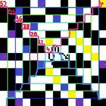 [open](telegram_shortlist_fullsize/51736.jpg) | keyword:matrixsumlist | sometimes i forget im muted here :D  52 = 13 * 2 * 2 44 = 11 * 2 * 2 36 = 9 * 2  * 2 28 = 7 * 2 * 2 20 = 5 * 2 * 2 12 = 3 * 2 * 2 4  = 1 * 2 * 2 (12 * 12 ) + (13 * 2 * 2) = 196 = 14*14 (10 * 10)  + (1 |
| 51960 | 2025-12-04T02:22:34 | gnomad | image |  [open](telegram_shortlist_fullsize/51960.jpg) | keyword:guide | 42 is mentioned in hitchhikers guide to the galaxy as the answer to everything |
| 52250 | 2025-12-12T16:19:17 | Cereal Killer | image |  [open](telegram_shortlist_fullsize/52250.jpg) | keyword:dbbi, keyword:yellow blue | i think MG which 13 and 7(divisible factor of 91) dbbi and if you go with prime cipher MG decrypted as 41 17(obvious 13th prime and 7th prime) 1741 is also in A141920(anstoo) oeis, my interpretation,  |
| 54196 | 2026-01-03T16:49:50 | 3.14159265358979323846264338327950288419716939937510 0b1one\|58209749445923078164062862089986280348253421170679 | image | 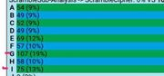 [open](telegram_shortlist_fullsize/54196.jpg) | keyword:faed | moving the straddles changes the freq , possibly  this move could match faed |
| 54595 | 2026-01-07T08:50:46 | 3.14159265358979323846264338327950288419716939937510 0b1one\|58209749445923078164062862089986280348253421170679 | image | 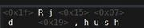 [open](telegram_shortlist_fullsize/54595.jpg) | keyword:dbbi | here's a funny one: from remains of dbbi |
| 54598 | 2026-01-07T12:05:37 | GN93 | image |  [open](telegram_shortlist_fullsize/54598.jpg) | keyword:next step | Why I can’t get to next step when I enter correct password? What am I doing wrong |
| 58023 | 2026-01-20T09:05:01 | GN93 | image | 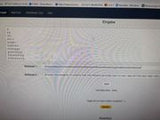 [open](telegram_shortlist_fullsize/58023.jpg) | keyword:dbbi | Maybe the hint is meant like this somehow ? Dbbi can give you 13 rows, letters 1-13 probably useless but just an idea |
| 59659 | 2026-02-09T09:01:22 | S \| h | video | [open](telegram_shortlist_fullsize/59659.mp4) | keyword:guide | phase2 seems to give hints to access salph  Q : iw below -> im below -> 82 -> ate too  b -> 16 -> b16 S -> 2 + (5 * 6)  hitchhiker's guide , text? |
| 60275 | 2026-03-03T17:32:46 | Robby | image | 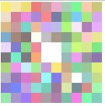 [open](telegram_shortlist_fullsize/60275.jpg) | keyword:faed | Faed string represented as css , was worth a shot |
| 60353 | 2026-03-04T04:04:47 | Denis Golovkin | text | [open](telegram_shortlist_fullsize/60353.txt) | same_sender_within_window_of_60313, same_sender_within_window_of_60325, same_sender_within_window_of_60333, same_sender_within_window_of_60352 | OCR with errors |
| 60706 | 2026-03-18T06:01:05 | Cereal Killer | midi | [open](telegram_shortlist_fullsize/60706.mid) | keyword:dbbi |  |
| 60707 | 2026-03-18T06:01:05 | Cereal Killer | midi | [open](telegram_shortlist_fullsize/60707.mid) | keyword:dbbi |  |
| 60709 | 2026-03-18T06:12:37 | .// | text | [open](telegram_shortlist_fullsize/60709.md) | keyword:faed | I'm playing with letters on FAED. It's interesting that I'm making some words. |
| 61428 | 2026-04-14T02:36:22 | X | image |  [open](telegram_shortlist_fullsize/61428.jpg) | keyword:dbbi | if there is a pattern, it means dbbi is decipherable |
| 61439 | 2026-04-15T21:22:34 | Flo Sku | image |  [open](telegram_shortlist_fullsize/61439.jpg) | keyword:dbbi | dbbi has the same length as the first string in btcseed |
| 61455 | 2026-04-16T08:14:53 | Flo Sku | image | 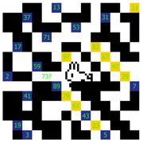 [open](telegram_shortlist_fullsize/61455.jpg) | keyword:dbbi, same_sender_within_window_of_61456 | counter clockwise, starting from top left. B matching blue squares and BE matching yellow squares in the dbbi string, with an extra B in place of the fefefe square, so it must be a blue one. not ai ha |
| 61488 | 2026-04-17T02:58:52 | Denis Golovkin | image | 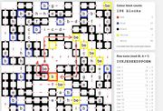 [open](telegram_shortlist_fullsize/61488.jpg) | same_sender_within_window_of_61489 | As missmatch begins after "FE" square, there was assumption, that first missmatched "b" could be moved to FE, then next two would match their yellow sqares, leaving last two blue + yellow empty. |
| 62292 | 2026-05-02T23:05:20 | 3.14159265358979323846264338327950288419716939937510 0b1one\|58209749445923078164062862089986280348253421170679 | image | 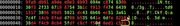 [open](telegram_shortlist_fullsize/62292.jpg) | keyword:matrixsumlist | openssl enc -aes-256-cbc -d -a -in salph.aes -md md5 -pass pass:"matrixsumlistenterlastwordsbeforearchichoicethispasswordmatrixsumlist" -nopad |
| 63518 | 2026-05-22T12:59:21 | X | text | [open](telegram_shortlist_fullsize/63518.py) | keyword:dbbi, keyword:faed |  |

## Stage 3 status

OCR/text-extraction results for each row are recorded in
`tools/gsmg/FINDINGS.md` once reviewed. This table is not updated after OCR —
it is the frozen input list, not the output.
