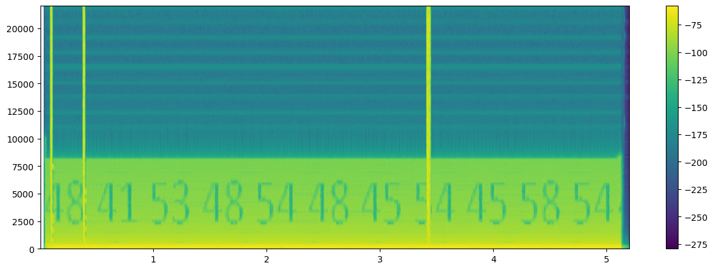

# `HASHTHETEXT` spectrogram image provenance



The adjacent PNG is the saved output of the spectrogram cell in Naddiseo's
`decentraland.ipynb`, inspected at the project's recorded upstream commit
`15b43fc`. The notebook decodes the Decentraland MP3, negates the right
channel, forms the mono stereo difference (`L-R`), and calls
`plt.specgram(new_data, Fs=samplerate)`.

The visible glyph rail reads:

```text
48 41 53 48 54 48 45 54 45 58 54
```

Interpreting those values as hexadecimal ASCII yields `HASHTHETEXT`.

## Frozen artifact checks

| Artifact | Bytes | Dimensions | SHA-256 |
|---|---:|---:|---|
| `GSMG_HASHTHETEXT_SPECTROGRAM.png` | 316,725 | 1128×428 RGBA | `b52b5b13bfab50079d726658ace9f0e5f99ae449cb8b3a228db8f06d7790a3c9` |
| `decentraland-assets/puzzlepiece.mp3` | 212,031 | stereo, 44.1 kHz | `ef17a96dce37b4dd7cbf79f210c5cbaf37fcae60e5faf8004de4e0832bd0dfee` |

The PNG is an extracted upstream notebook output, not a newly styled or
manually annotated reconstruction. Phase 457 independently authenticated and
decoded the checked-in MP3 and reproduced the `L-R` signal. Retaining the
original notebook rendering here makes the literal glyph evidence directly
inspectable while keeping its community-source provenance explicit.

The image does not establish that MPEG frames 4, 15, and 131 select letters.
Phase 457's timing appendix places those frame anomalies in blank inter-glyph
regions and leaves the no-additional-payload verdict unchanged.
